<h1 align="center">Hi, I'm k-is-sick </h1>

MLOps / AI-ML · building infra by hand before trusting the managed version

  <picture>
    <source media="(prefers-color-scheme: dark)" srcset="dark_mode.svg">
    <source media="(prefers-color-scheme: light)" srcset="light_mode.svg">
    
  </picture>

<i>Stats above update automatically once a day via GitHub Actions — see <code>today.py</code>.</i>

---

### What I'm building

- **LocalAWS** — a local AWS clone (Docker + Flask + Python): Mini-S3, Mini-EC2 using Docker containers as instances with `ttyd` for browser-based console access, and Mini-IAM with AWS-style users, access keys, and JSON policy documents.
- Client AWS setups — account/IAM/MFA foundations and billing guardrails.
- Working through AWS end to end: VPC architecture, S3 → Glue → Athena ETL pipelines, Rekognition-based serverless detection apps.

---

### Projects

| Project | What it does | Stack |
|---|---|---|
| **[LocalAWS](https://github.com/k-is-sick/Local_AWS)** | Local AWS clone with Mini-S3, Mini-EC2 (Docker-as-instances w/ browser terminals), and Mini-IAM (policy-based access control) | Python, Flask, PostgreSQL, Docker |
| **AWS VPC Architecture** | Full public/private subnet setup with Flask frontend, MySQL backend, NAT Gateway, and IGW | AWS, Flask, MySQL |
| **AWS ETL Pipeline** | S3 → Glue ETL (PySpark) → Glue Crawler pipeline on a synthetic dataset with intentional data quality issues | AWS S3, Glue, PySpark |
| **Serverless Gun Detection App** | Real-time object detection app on AWS using Rekognition Custom Labels, achieving perfect F1/precision/recall | AWS Rekognition, Lambda, API Gateway, S3 |
| **ML Model Deployment (FastAPI + Docker)** | Trained model served via FastAPI, containerized end-to-end, runnable from Colab | Python, Scikit-learn, FastAPI, Docker |
| **3-Container MLOps App** | MySQL + Node.js/Express + frontend with health-check-enforced startup ordering | Docker Compose, MySQL, Node.js |
| **Credit Card Fraud Detection** | Imbalanced classification (~0.17% fraud rate) comparing raw, undersampled, and SMOTE-balanced Logistic Regression, evaluated on recall/precision/ROC-AUC | Python, Scikit-learn, SMOTE |
| **ALERT — Driver Drowsiness Detection** | Edge AI system using facial landmarks (EAR/MAR/PERCLOS) on Raspberry Pi 5 / Jetson Orin Nano — 96.4% accuracy at <5ms latency | Python, OpenCV, Edge AI |
| **Gemma Fine-Tuning for Mental Health** | Parameter-efficient fine-tuning of Google Gemma using SFTTrainer + LoRA | Hugging Face, LoRA, BitsAndBytes |

---

### Stack

<table>
<tr>
<td> C</td>
<td> C++</td>
<td> C#</td>
<td> HTML5</td>
</tr>
<tr>
<td> CSS3</td>
<td> Go</td>
<td> Python</td>
<td> Jupyter</td>
</tr>
<tr>
<td> PyTorch</td>
<td> Pytest</td>
<td> AWS</td>
<td> Anaconda</td>
</tr>
<tr>
<td> Android</td>
<td> Android Studio</td>
<td> Arduino</td>
<td> Bash</td>
</tr>
<tr>
<td> Blender</td>
<td> Dart</td>
<td> Debian</td>
<td> Docker</td>
</tr>
<tr>
<td> .NET</td>
<td> .NET Core</td>
<td> FileZilla</td>
<td> Flutter</td>
</tr>
<tr>
<td> Flask</td>
<td> GCC</td>
<td> Git</td>
<td> GitHub</td>
</tr>
<tr>
<td> GitLab</td>
<td> Google Cloud</td>
<td> IntelliJ</td>
<td> JetBrains</td>
</tr>
<tr>
<td> Java</td>
<td> JavaScript</td>
<td> Kaggle</td>
<td> Kotlin</td>
</tr>
<tr>
<td> Kubernetes</td>
<td> Linux</td>
<td> Lua</td>
<td> Markdown</td>
</tr>
<tr>
<td> MATLAB</td>
<td> MySQL</td>
<td> MongoDB</td>
<td> Nginx</td>
</tr>
<tr>
<td> Node.js</td>
<td> npm</td>
<td> NuGet</td>
<td> NumPy</td>
</tr>
<tr>
<td> OpenCV</td>
<td> OpenGL</td>
<td> Oracle</td>
<td> Pandas</td>
</tr>
<tr>
<td> PostgreSQL</td>
<td> PyCharm</td>
<td> PuTTY</td>
<td> React</td>
</tr>
<tr>
<td> SQLite</td>
<td> Swift</td>
<td> TensorFlow</td>
<td> Unix</td>
</tr>
<tr>
<td> Vim</td>
<td> Visual Studio</td>
<td> VS Code</td>
<td></td>
</tr>
</table>

---

This README's stats card is generated by a script in this repo, not a third-party badge service.
